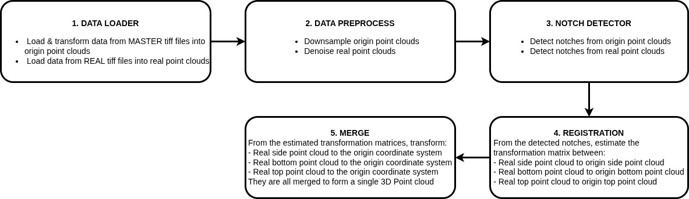

# Point Cloud Registration Solution

- **Last update**: February 09, 2026
- **Author**: Hoa Huynh

## Introduction

This is the C++ implementation of the **Point Cloud Registration Solution** which relies on **Notch Region Detection** and **Correspondence Matching between Real Point Cloud and Master Point Cloud**. In the final output, the 3 real point clouds are merged together into a **single 3D point cloud**. The proposed solution consists of 5 steps, as illustrated below:



---
## Solution Directory Structure

    .

    ├── 3D                             # Directory contains input TIFF files

    ├── OUTPUT                         # Directory contains output artifacts

    ├── assets                         # Directory contains images

    ├── include                        # Directory contains header files

    |     ├─── utils.hpp               # Contain headers + typedefs + constants

    |     ├─── DataLoader.hpp          # "DataLoader" function declaration

    |     ├─── DataPreprocess.hpp      # "Data Preprocess" function declaration

    |     ├─── NotchDetector.hpp       # "Notch Detector" function declaration

    |     ├─── Registration.hpp        # "Registration" function declaration

    |     ├─── Merge.hpp               # "Merge" function declaration

    ├── src                            # Directory that contains source files

    |     ├─── main.cpp                # Entry source file to run the entire pipeline

    |     ├─── DataLoader.cpp          # "Data Loader" function definition

    |     ├─── DataPreprocess.cpp      # "Data Preprocess" function definition

    |     ├─── NotchDetector.cpp       # "Notch Detector" function definition

    |     ├─── Registration.cpp        # "Registration" function definition

    |     ├─── TransformEstimator.cpp  # "Merge" function definition

    ├── CMakeLists.txt                 # CMake test script to build the solution

    ├── compile.sh                     # The bash command to build the solution

    ├── .gitignore                     # Untracked files that Git should ignore

## Usage Guideline
### 1. Requirements

- The solution was developed using these dependencies:
    - [opencv-4.10.0](https://github.com/opencv/opencv/releases/tag/4.10.0)
    - [pcl-1.15.1](https://github.com/PointCloudLibrary/pcl/releases/tag/pcl-1.15.1)
    - [flann-1.9.2](https://github.com/flann-lib/flann/releases/tag/1.9.2)
    - [eigen-3.3.0](https://gitlab.com/libeigen/eigen/-/releases/3.3.0)
    - [boost-1.74.0](https://www.boost.org/releases/1.74.0/)
- Operating System: Ubuntu 20.04

- Furthermore, CMake is required to build these dependencies and the solution; the CMake version I used is [3.22.1](https://gitlab.kitware.com/cmake/cmake/-/tags/v3.22.1)

### 2. Build

Please run the following command to build the solution:

```
chmod -R 777 compile.sh
./compile.sh
```

After finishing the above command, the binary file named `pointcloud_registration` will be generated.

### 3. Run
- First, please make sure every `TIFF` files are placed into the directory `3D`
- Run the solution (with the default config parameters) using the following command:

```bash
./pointcloud_registration
```

- When the solution launch is completed, some output artifacts will be generated and saved into the directory `OUTPUT` as below:
    - `args_[args1]_[args2]_[args3]_[args4]_[args5]_dsOrigin[Bottom/Top/Side].pcd`: downsampled origin point clouds
    - `args_[args1]_[args2]_[args3]_[args4]_[args5]_dsReal[Bottom/Top/Side].pcd`: denoised real point clouds
    - `args_[args1]_[args2]_[args3]_[args4]_[args5]_merge[Bottom/Top/Side]Notch.pcd`: the aligned notches from real point cloud with its corresponding origin point cloud
    - `args_[args1]_[args2]_[args3]_[args4]_[args5]_mergeReal.pcd`: all denoised real point clouds merged into the origin coordinate system
    - `args_[args1]_[args2]_[args3]_[args4]_[args5]_transformReal.txt`: 3 transformation matrices of `REAL SIDE`/`REAL BOTTOM`/`REAL TOP` with respect to the **origin coordinate system**

- The solution supports 5 config parameters in the order below. Tuning these values may result in different preprocessed point clouds, which also leads to different registration results.
    - **arg1**: the floating point leaf size for downsampling the origin point cloud (default is `0.05`)
    - **arg2**: the integer number of neighbors to analyze for denoising the real point cloud (default is `50`)
    - **arg3**: the standard deviation multiplier threshold for denoising the real point cloud (default is `1.0`)
    - **arg4**: the threshold value for y-value segmentation along the Oy-axis to denoise the real point cloud TOP/BOTTOM (default is `1.0`)
    - **arg5**: the minimum height ratio threshold for denoising the real point cloud (default is `0.3`)

One can run the solution with other configuration values using the following command:

```bash
./pointcloud_registration <arg1> <arg2> <arg3> <arg4> <arg5>
```

for example:

```bash
./pointcloud_registration 0 25 0.75 0.75 0.4
```

## Thank you for your interest!
